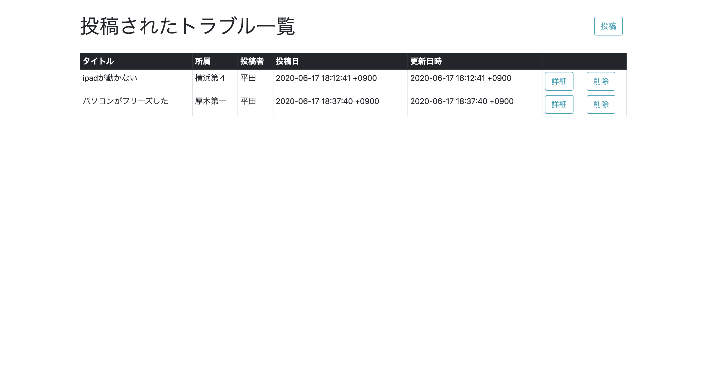
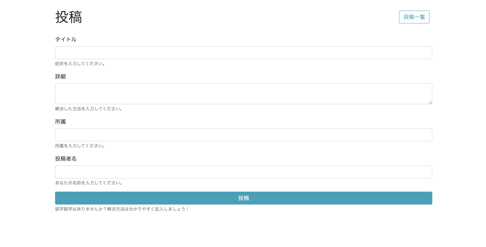
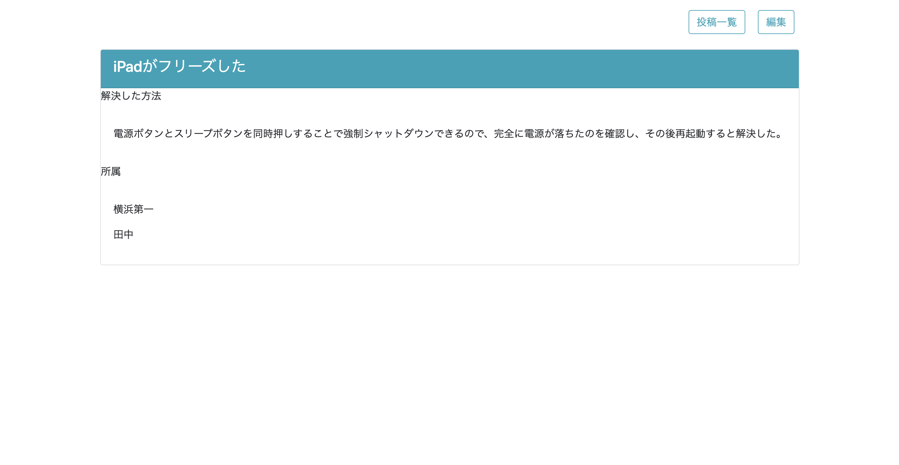

# eService mini

 社内で発生するITトラブルをお互いに共有することができる掲示板アプリです。
 
 
## Description
 
誰でも投稿できるアプリであり、トラブルの概要、詳細と解決法を入力することで簡単に投稿できます。
投稿一覧、詳細画面、投稿ページという構成になっています。

 
 
## Requirement
 
* Rails 5.2.4.3
* ruby 2.5.1
 
 
## Usage
 前職は医療関係ということもあり、ITリテラシーが高い社員ばかりではなく、簡単なITトラブルも対処できずに、
 本社のIT管理部門(eService)に問い合わせが殺到しておりました。
 その結果電話が繋がらず、解決までに時間をロスしている現状がありました。
 本アプリはIT機器に関するトラブルと解決法を全国の社員同士で共有することで、社員が自力で解決できるよう手助けするものであり、
 同時にIT管理部門へのイージートラブルの問い合わせを減らすことで負担を軽減するためのものです。
 
## Author
 平田陽亮
 ポートフォリオ
 https://taraprof.com
